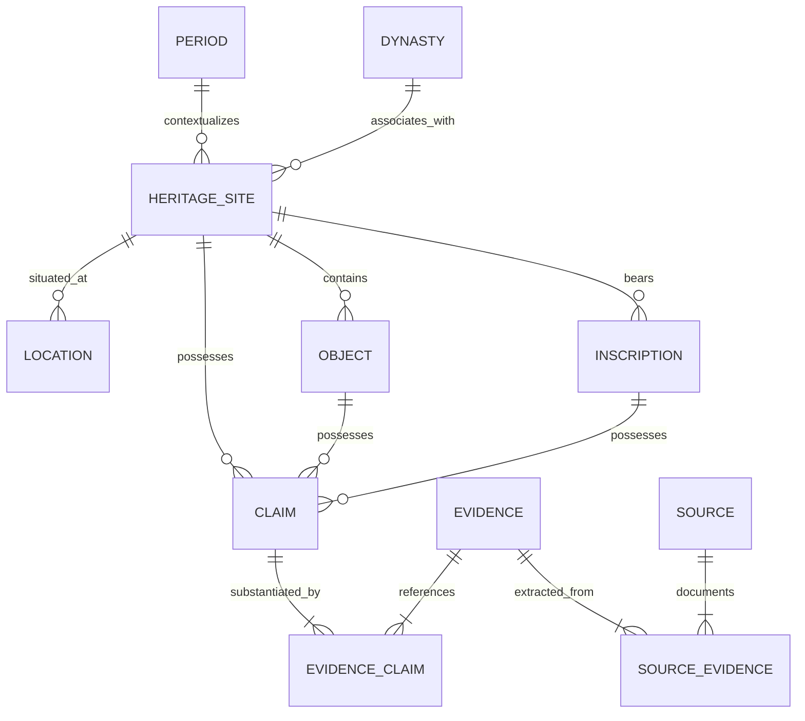

# Data Model Specification — Bharat Heritage Atlas

## 1. Conceptual Entity Architecture

The data model is structured around two intersecting subsystems:
1. **Heritage Domain Entities**: Physical sites, geographical locations, artifacts, architectural components, inscriptions, chronological periods, and ruling dynasties.
2. **Epistemic Evidence Engine**: Claims, evidence assessments, and bibliographic sources that substantiate or challenge historical statements.

---

## 2. Core Entities

### A. Heritage Entities
* **`heritage_sites`**: Monuments, archaeological complexes, caves, temples, excavation mounds.
* **`locations`**: Normalized geographical coordinates, modern administrative divisions (state, district, taluk), historical topography.
* **`periods`**: Historical epochs (e.g., Vedic, Mauryan, Shunga, Kushan, Gupta, Early Medieval).
* **`dynasties`**: Ruling houses and royal lineages.
* **`objects`**: Portable or fixed physical cultural material (sculptures, lingas, pillars, coins, terracotta relics).
* **`inscriptions`**: Epigraphic records with language, script, trans-literation, translation, and historical donor/king attributions.

### B. Evidence & Epistemic Entities
* **`claims`**: Specific historical assertions (e.g., *"The Gudimallam Linga phallus and anthropomorphic figure date to the 3rd–2nd century BCE"*).
* **`evidence`**: Material or analytical proofs supporting or challenging a claim (classification: `STRONG_EVIDENCE`, `GOOD_EVIDENCE`, `SCHOLARLY_DEBATE`, `TRADITIONAL_ACCOUNT`, `UNVERIFIED`).
* **`sources`**: Bibliographic records (ASI reports, epigraphic corpora, peer-reviewed monographs, journal papers) with authors, publication year, DOI, and page numbers.

---

## 3. Historical Dating Model

Historical dates must not be compressed into single standard timestamps. The schema implements a dual dating representation:

1. **Human Historiographical Statement (`raw_dating_statement`)**:
   * E.g., *"circa late 2nd century BCE (c. 110 BCE)"*, *"4th regnal year of Antialcidas"*, *"mid-1st millennium CE"*.
2. **Machine-Readable Chronology**:
   * `start_year`: Integer representing astronomical year (-150 for 151 BCE, 100 for 100 CE).
   * `end_year`: Integer representing upper bound of the temporal estimate.
   * `start_era` / `end_era`: Enum (`BCE`, `CE`).
   * `century`: Textual century indicator (e.g., "2nd century BCE").
   * `is_approximate`: Boolean flag.
   * `dating_method`: Epigraphic paleography, archaeological stratigraphy, carbon dating, stylistics.
