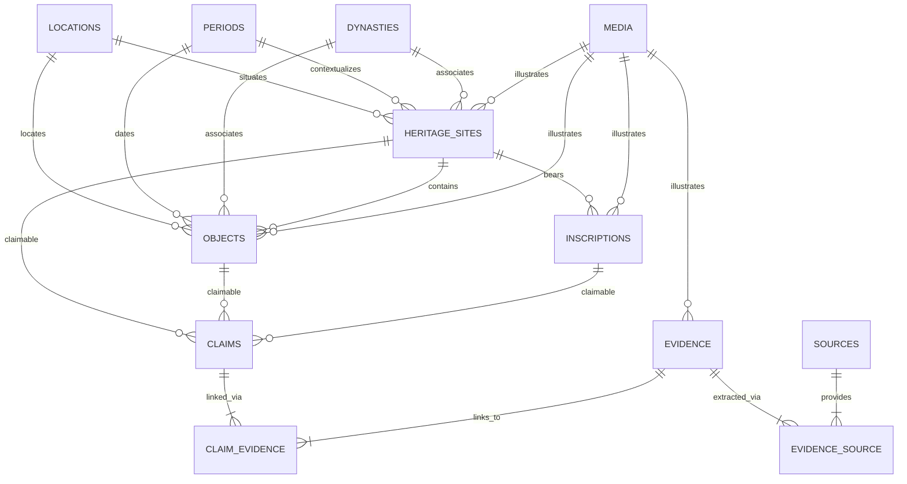

# Relational Schema Specification — Bharat Heritage Atlas

This specification details the normalized relational database architecture for Bharat Heritage Atlas. The architecture enforces evidence traceability, chronological nuance, and source verifiability at the database layer.

---

## 1. Schema Entity-Relationship Blueprint

---

## 2. Table Specifications

### 2.1 `locations`
Stores normalized geographical data and administrative boundaries for heritage sites and artifact findspots.

| Column | Type | Nullable | Description & Constraints |
| :--- | :--- | :--- | :--- |
| `id` | `BIGINT UNSIGNED` | NO | Auto-increment Primary Key. |
| `name` | `VARCHAR(255)` | NO | Primary modern place name (e.g., "Gudimallam", "Besnagar / Vidisha"). |
| `historical_names` | `JSON` | YES | Array of historical toponyms (e.g., `["Vidisā", "Vessanagara"]`). |
| `state` | `VARCHAR(100)` | NO | Modern Indian State / UT (e.g., "Andhra Pradesh", "Madhya Pradesh"). |
| `district` | `VARCHAR(100)` | NO | Administrative district (e.g., "Tirupati", "Vidisha"). |
| `taluk_tehsil` | `VARCHAR(100)` | YES | Sub-district or taluka. |
| `latitude` | `DECIMAL(10, 7)` | YES | WGS84 Latitude. |
| `longitude` | `DECIMAL(10, 7)` | YES | WGS84 Longitude. |
| `altitude_meters` | `INT` | YES | Elevation in meters above sea level. |
| `uncertainty_radius_meters` | `INT` | YES | Margin of error for approximate coordinates/findspots. |
| `description` | `TEXT` | YES | Geographical description, river basins, ancient trade routes. |
| `created_at` / `updated_at` | `TIMESTAMP` | YES | Standard Laravel timestamps. |

**Indexes**:
* `INDEX idx_locations_state_district (state, district)`
* `INDEX idx_locations_lat_lng (latitude, longitude)`

---

### 2.2 `periods`
Chronological eras representing major historical epochs.

| Column | Type | Nullable | Description & Constraints |
| :--- | :--- | :--- | :--- |
| `id` | `BIGINT UNSIGNED` | NO | Primary Key. |
| `name` | `VARCHAR(150)` | NO | Epoch name (e.g., "Mauryan", "Shunga-Kanva", "Early Historic", "Satavahana"). |
| `slug` | `VARCHAR(150)` | NO | Unique URL slug. |
| `dating_statement` | `VARCHAR(255)` | NO | Historiographical date statement (e.g., "c. 322 BCE – 185 BCE"). |
| `start_year` | `INT` | NO | Astronomical start year (-322 for 323 BCE). |
| `end_year` | `INT` | NO | Astronomical end year (-185 for 185 BCE). |
| `start_era` | `ENUM('BCE', 'CE')` | NO | Astronomical era designation. |
| `end_era` | `ENUM('BCE', 'CE')` | NO | Astronomical era designation. |
| `description` | `TEXT` | YES | Historical synthesis of the era. |
| `created_at` / `updated_at` | `TIMESTAMP` | YES | Laravel timestamps. |

**Indexes**:
* `UNIQUE KEY unq_periods_slug (slug)`
* `INDEX idx_periods_start_end (start_year, end_year)`

---

### 2.3 `dynasties`
Ruling lineages and royal houses.

| Column | Type | Nullable | Description & Constraints |
| :--- | :--- | :--- | :--- |
| `id` | `BIGINT UNSIGNED` | NO | Primary Key. |
| `name` | `VARCHAR(150)` | NO | Dynasty name (e.g., "Shunga", "Satavahana", "Indo-Greek", "Gupta"). |
| `slug` | `VARCHAR(150)` | NO | Unique URL slug. |
| `dating_statement` | `VARCHAR(255)` | YES | E.g., "c. 185 BCE – 73 BCE". |
| `start_year` | `INT` | YES | Astronomical start year (-185). |
| `end_year` | `INT` | YES | Astronomical end year (-73). |
| `region` | `VARCHAR(255)` | YES | Primary sphere of rule (e.g., "Magadha and Central India"). |
| `capital` | `VARCHAR(255)` | YES | Royal capitals (e.g., "Pataliputra, Vidisha"). |
| `description` | `TEXT` | YES | Political and cultural context. |
| `created_at` / `updated_at` | `TIMESTAMP` | YES | Laravel timestamps. |

**Indexes**:
* `UNIQUE KEY unq_dynasties_slug (slug)`

---

### 2.4 `heritage_sites`
Physical monuments, archaeological complexes, rock-cut shrines, and excavation mounds.

| Column | Type | Nullable | Description & Constraints |
| :--- | :--- | :--- | :--- |
| `id` | `BIGINT UNSIGNED` | NO | Primary Key. |
| `name` | `VARCHAR(255)` | NO | Official/monument name (e.g., "Parasurameshwara Temple Complex, Gudimallam"). |
| `slug` | `VARCHAR(255)` | NO | Unique URL slug. |
| `location_id` | `BIGINT UNSIGNED` | YES | Foreign Key -> `locations.id` (ON DELETE SET NULL). |
| `primary_period_id` | `BIGINT UNSIGNED` | YES | Foreign Key -> `periods.id` (ON DELETE SET NULL). |
| `primary_dynasty_id`| `BIGINT UNSIGNED` | YES | Foreign Key -> `dynasties.id` (ON DELETE SET NULL). |
| `site_type` | `VARCHAR(100)` | NO | Classification (e.g., "Temple Complex", "Free-standing Pillar", "Stupa Complex"). |
| `dating_statement` | `VARCHAR(255)` | NO | Historiographical dating (e.g., "Phase I: c. 3rd–2nd century BCE; Phase II: c. 2nd–3rd century CE"). |
| `start_year` | `INT` | YES | Lower astronomical boundary (-300). |
| `end_year` | `INT` | YES | Upper astronomical boundary (300). |
| `is_dating_uncertain`| `BOOLEAN` | NO | Flag indicating unresolved chronological dispute (Default: `false`). |
| `protection_status` | `VARCHAR(150)` | NO | E.g., "ASI Protected Monument of National Importance". |
| `summary` | `TEXT` | NO | Concise encyclopedic overview. |
| `historical_context`| `LONGTEXT` | YES | In-depth historical narrative with references. |
| `architectural_description` | `LONGTEXT` | YES | Detailed layout, orientation, and masonry notes. |
| `is_published` | `BOOLEAN` | NO | Default: `false`. |
| `created_at` / `updated_at` | `TIMESTAMP` | YES | Laravel timestamps. |

**Indexes**:
* `UNIQUE KEY unq_sites_slug (slug)`
* `INDEX idx_sites_site_type (site_type)`
* `INDEX idx_sites_start_end (start_year, end_year)`

---

### 2.5 `objects`
Individual sculptures, lingas, architectural elements, reliquaries, and coins.

| Column | Type | Nullable | Description & Constraints |
| :--- | :--- | :--- | :--- |
| `id` | `BIGINT UNSIGNED` | NO | Primary Key. |
| `name` | `VARCHAR(255)` | NO | Object name (e.g., "Gudimallam Anthropomorphic Shiva Linga"). |
| `slug` | `VARCHAR(255)` | NO | Unique slug. |
| `heritage_site_id` | `BIGINT UNSIGNED` | YES | Foreign Key -> `heritage_sites.id` (ON DELETE SET NULL). |
| `location_id` | `BIGINT UNSIGNED` | YES | Foreign Key -> `locations.id` (findspot / current repository). |
| `period_id` | `BIGINT UNSIGNED` | YES | Foreign Key -> `periods.id` (ON DELETE SET NULL). |
| `dynasty_id` | `BIGINT UNSIGNED` | YES | Foreign Key -> `dynasties.id` (ON DELETE SET NULL). |
| `object_type` | `VARCHAR(100)` | NO | E.g., "Linga", "Anthropomorphic Sculpture", "Pillar Capital", "Coin". |
| `material` | `VARCHAR(150)` | NO | E.g., "Hard igneous stone", "Chunar sandstone", "Red mottled sandstone". |
| `dimensions` | `VARCHAR(255)` | YES | E.g., "Height: 152 cm, Linga shaft diameter: ~34 cm". |
| `current_repository`| `VARCHAR(255)` | NO | Current location (e.g., "In situ sanctum", "Indian Museum, Kolkata"). |
| `accession_number` | `VARCHAR(100)` | YES | Institutional museum accession code. |
| `dating_statement` | `VARCHAR(255)` | NO | E.g., "c. 3rd–2nd century BCE (I.K. Sarma) / c. 1st century BCE (Coomaraswamy)". |
| `start_year` | `INT` | YES | Astronomical year estimate (-250). |
| `end_year` | `INT` | YES | Astronomical year estimate (-100). |
| `is_dating_uncertain`| `BOOLEAN` | NO | Default: `false`. |
| `description` | `TEXT` | NO | Formal object description. |
| `iconographic_notes`| `TEXT` | YES | Iconographic attributes (vahana, emblems, mudras, garments). |
| `is_published` | `BOOLEAN` | NO | Default: `false`. |
| `created_at` / `updated_at` | `TIMESTAMP` | YES | Standard timestamps. |

**Indexes**:
* `UNIQUE KEY unq_objects_slug (slug)`
* `INDEX idx_objects_type (object_type)`

---

### 2.6 `inscriptions`
Epigraphic texts carved on stone, copper plates, or monuments.

| Column | Type | Nullable | Description & Constraints |
| :--- | :--- | :--- | :--- |
| `id` | `BIGINT UNSIGNED` | NO | Primary Key. |
| `title` | `VARCHAR(255)` | NO | E.g., "Besnagar Garuda Pillar Inscription of Heliodorus (Inscription A)". |
| `slug` | `VARCHAR(255)` | NO | Unique slug. |
| `heritage_site_id` | `BIGINT UNSIGNED` | YES | Foreign Key -> `heritage_sites.id`. |
| `object_id` | `BIGINT UNSIGNED` | YES | Foreign Key -> `objects.id` (pillar shaft, pedestal). |
| `language` | `VARCHAR(100)` | NO | E.g., "Epigraphic Prakrit with Sanskrit influence". |
| `script` | `VARCHAR(100)` | NO | E.g., "Middle Brahmi". |
| `dating_statement` | `VARCHAR(255)` | NO | E.g., "c. 113 BCE (14th regnal year of King Bhagabhadra)". |
| `start_year` | `INT` | YES | Astronomical year (-113). |
| `end_year` | `INT` | YES | Astronomical year (-113). |
| `donor` | `VARCHAR(255)` | YES | E.g., "Heliodoros, son of Dion, ambassador of Antialkidas". |
| `ruler_mentioned` | `VARCHAR(255)` | YES | E.g., "King Kasiputra Bhagabhadra; Indo-Greek King Antialkidas". |
| `epigraphic_reference` | `VARCHAR(255)` | YES | Reference corpus code (e.g., "Epigraphia Indica X, p. 52; Lüders No. 669"). |
| `raw_text` | `TEXT` | YES | Original text transliterated in IAST. |
| `translation` | `TEXT` | NO | Authoritative English translation. |
| `interpretation_notes` | `TEXT` | YES | Philological, religious, or political commentary. |
| `is_published` | `BOOLEAN` | NO | Default: `false`. |
| `created_at` / `updated_at` | `TIMESTAMP` | YES | Standard timestamps. |

**Indexes**:
* `UNIQUE KEY unq_inscriptions_slug (slug)`

---

### 2.7 `sources`
Primary archaeological publications, epigraphic corpora, museum catalogs, and academic research monographs.

| Column | Type | Nullable | Description & Constraints |
| :--- | :--- | :--- | :--- |
| `id` | `BIGINT UNSIGNED` | NO | Primary Key. |
| `title` | `VARCHAR(500)` | NO | Full title of publication. |
| `authors` | `VARCHAR(500)` | NO | Authors / Editors (e.g., "Sarma, Inguva Karthikeya", "Bhandarkar, D. R."). |
| `publication_year` | `INT` | YES | Year of publication (e.g., 1982). |
| `source_type` | `ENUM(...)` | NO | `'EXCAVATION_REPORT'`, `'EPIGRAPHIC_CORPUS'`, `'PEER_REVIEWED_JOURNAL'`, `'ACADEMIC_MONOGRAPH'`, `'MUSEUM_CATALOGUE'`, `'REFERENCE_WORK'`, `'ARCHIVAL_DOCUMENT'`. |
| `publisher` | `VARCHAR(255)` | YES | Publisher name (e.g., "Archaeological Survey of India"). |
| `journal_or_series`| `VARCHAR(255)` | YES | E.g., "Epigraphia Indica", "Annual Report of ASI". |
| `volume_issue` | `VARCHAR(100)` | YES | E.g., "Vol. X, Pt. II". |
| `pages` | `VARCHAR(100)` | YES | E.g., "pp. 52–60". |
| `doi` | `VARCHAR(150)` | YES | Digital Object Identifier. |
| `isbn_issn` | `VARCHAR(100)` | YES | Standard book/serial number. |
| `url` | `VARCHAR(500)` | YES | Stable repository or institutional link. |
| `access_date` | `DATE` | YES | Verification access date. |
| `archival_location`| `VARCHAR(255)` | YES | Physical library/archive (e.g., "ASI Central Archaeological Library"). |
| `reliability_tier` | `ENUM(...)` | NO | `'TIER_1_PRIMARY_EXCAVATION_EPIGRAPHY'`, `'TIER_2_PEER_REVIEWED_ACADEMIC'`, `'TIER_3_SCHOLARLY_SURVEY'`. |
| `notes` | `TEXT` | YES | Annotations regarding editions or revisions. |
| `created_at` / `updated_at` | `TIMESTAMP` | YES | Standard timestamps. |

**Indexes**:
* `INDEX idx_sources_authors (authors)`
* `INDEX idx_sources_type_tier (source_type, reliability_tier)`

---

### 2.8 `claims`
Atomized historical statements attached polymorphically to Sites, Objects, or Inscriptions.

| Column | Type | Nullable | Description & Constraints |
| :--- | :--- | :--- | :--- |
| `id` | `BIGINT UNSIGNED` | NO | Primary Key. |
| `claimable_type` | `VARCHAR(255)` | NO | Polymorphic entity class (`App\Models\HeritageSite`, `App\Models\HeritageObject`, `App\Models\Inscription`). |
| `claimable_id` | `BIGINT UNSIGNED` | NO | Target entity ID. |
| `claim_type` | `ENUM(...)` | NO | `'CHRONOLOGY'`, `'ATTRIBUTION'`, `'ARCHAEOLOGICAL_STRATIGRAPHY'`, `'ICONOGRAPHIC_IDENTITY'`, `'PATRONAGE'`, `'EPIGRAPHIC_READING'`, `'HISTORICAL_CONTEXT'`. |
| `statement` | `TEXT` | NO | Precise historical proposition (e.g., "The anthropomorphic linga at Gudimallam was erected within a square brick apsidal floor datable stratigraphically to Phase I (c. 3rd–2nd c. BCE)"). |
| `consensus_status` | `ENUM(...)` | NO | `'SETTLED_CONSENSUS'`, `'STRONG_CONSENSUS'`, `'ONGOING_DEBATE'`, `'MINORITY_VIEW'`, `'DISCREDITED_HYPOTHESIS'`. |
| `summary_justification` | `TEXT` | YES | Summary of academic status and discussion. |
| `created_at` / `updated_at` | `TIMESTAMP` | YES | Standard timestamps. |

**Indexes**:
* `INDEX idx_claims_polymorphic (claimable_type, claimable_id)`
* `INDEX idx_claims_type_consensus (claim_type, consensus_status)`

---

### 2.9 `evidence`
Material and analytical data points that substantiate or challenge claims.

| Column | Type | Nullable | Description & Constraints |
| :--- | :--- | :--- | :--- |
| `id` | `BIGINT UNSIGNED` | NO | Primary Key. |
| `title` | `VARCHAR(255)` | NO | E.g., "ASI Stratigraphic Excavation at Gudimallam Sanctum (1973–74)". |
| `evidence_type` | `ENUM(...)` | NO | `'ARCHAEOLOGICAL'`, `'EPIGRAPHIC'`, `'NUMISMATIC'`, `'ARCHITECTURAL'`, `'ICONOGRAPHIC'`, `'LITERARY'`, `'MANUSCRIPT'`, `'ART_HISTORICAL'`, `'SCHOLARLY_INTERPRETATION'`, `'TRADITIONAL_ACCOUNT'`. |
| `classification` | `ENUM(...)` | NO | `'STRONG_EVIDENCE'`, `'GOOD_EVIDENCE'`, `'SCHOLARLY_DEBATE'`, `'TRADITIONAL_ACCOUNT'`, `'UNVERIFIED'`. |
| `description` | `TEXT` | NO | Detailed finding (e.g., "Excavations revealed two lower square brick apsidal enclosures and Mauryan-period brick sizes (42 x 21 x 7 cm) sealing the base of the linga shaft"). |
| `stratigraphic_context` | `VARCHAR(255)` | YES | Archaeological layer / trench identifier. |
| `methodology_applied` | `VARCHAR(255)` | YES | E.g., "Controlled stratigraphic excavation; pottery typological comparison (NBPW & Megalithic Black-and-Red ware)". |
| `uncertainty_notes` | `TEXT` | YES | Limitations, disturbances, or missing carbon dates. |
| `created_at` / `updated_at` | `TIMESTAMP` | YES | Standard timestamps. |

**Indexes**:
* `INDEX idx_evidence_class_type (classification, evidence_type)`

---

### 2.10 `claim_evidence` (Pivot)
Relates claims to specific evidence records, recording supporting or contradictory scholarly relationships.

| Column | Type | Nullable | Description & Constraints |
| :--- | :--- | :--- | :--- |
| `id` | `BIGINT UNSIGNED` | NO | Primary Key. |
| `claim_id` | `BIGINT UNSIGNED` | NO | Foreign Key -> `claims.id` (ON DELETE CASCADE). |
| `evidence_id` | `BIGINT UNSIGNED` | NO | Foreign Key -> `evidence.id` (ON DELETE CASCADE). |
| `relationship_type` | `ENUM(...)` | NO | `'SUPPORTS'`, `'CONTRADICTS'`, `'COMPLICATES'`, `'REINTERPRETS'`. |
| `scholarly_weight` | `ENUM(...)` | NO | `'PRIMARY'`, `'CORROBORATIVE'`, `'CHALLENGING'`, `'HISTORICAL_ALTERNATIVE'`. |
| `analysis_notes` | `TEXT` | YES | Historiographical rationale explaining why this evidence supports or refutes the claim. |
| `created_at` / `updated_at` | `TIMESTAMP` | YES | Standard timestamps. |

**Indexes**:
* `UNIQUE KEY unq_claim_evidence (claim_id, evidence_id, relationship_type)`

---

### 2.11 `evidence_source` (Pivot)
Connects evidence records to bibliographic literature with exact citation pointers.

| Column | Type | Nullable | Description & Constraints |
| :--- | :--- | :--- | :--- |
| `id` | `BIGINT UNSIGNED` | NO | Primary Key. |
| `evidence_id` | `BIGINT UNSIGNED` | NO | Foreign Key -> `evidence.id` (ON DELETE CASCADE). |
| `source_id` | `BIGINT UNSIGNED` | NO | Foreign Key -> `sources.id` (ON DELETE CASCADE). |
| `specific_pages` | `VARCHAR(150)` | YES | Specific page ranges, plates, or figure references (e.g., "pp. 142–158, Plates IV–VII"). |
| `direct_quotation_or_data` | `TEXT` | YES | Verbatim quotation or technical finding extracted from the source. |
| `citation_context` | `TEXT` | YES | Contextual notes regarding the citation. |
| `created_at` / `updated_at` | `TIMESTAMP` | YES | Standard timestamps. |

**Indexes**:
* `INDEX idx_evidence_source (evidence_id, source_id)`

---

### 2.12 `media`
Polymorphic media registry for high-resolution photographs, architectural site plans, rubbings, and maps.

| Column | Type | Nullable | Description & Constraints |
| :--- | :--- | :--- | :--- |
| `id` | `BIGINT UNSIGNED` | NO | Primary Key. |
| `mediable_type` | `VARCHAR(255)` | NO | Polymorphic entity class (`App\Models\HeritageSite`, `App\Models\HeritageObject`, `App\Models\Inscription`, `App\Models\Evidence`). |
| `mediable_id` | `BIGINT UNSIGNED` | NO | Target entity ID. |
| `file_path` | `VARCHAR(500)` | NO | Relative storage path. |
| `caption` | `VARCHAR(500)` | NO | Informative descriptive caption. |
| `alt_text` | `VARCHAR(255)` | NO | Accessible alternative text. |
| `media_type` | `ENUM(...)` | NO | `'PHOTOGRAPH'`, `'ARCHAEOLOGICAL_DRAWING'`, `'SITE_PLAN'`, `'INSCRIPTION_RUBBING'`, `'MAP'`. |
| `license` | `VARCHAR(100)` | NO | Licensing framework (e.g., "Public Domain", "CC BY-SA 4.0", "ASI Fair Use"). |
| `source_credit` | `VARCHAR(255)` | NO | Copyright holder, institutional archive, or photographer. |
| `photographer_or_draughtsman` | `VARCHAR(150)` | YES | Artist or surveyor name. |
| `capture_year` | `INT` | YES | Year media was captured or published. |
| `created_at` / `updated_at` | `TIMESTAMP` | YES | Standard timestamps. |

**Indexes**:
* `INDEX idx_media_polymorphic (mediable_type, mediable_id)`

---

## 3. Dual Historical Dating Architecture

1. **Human Historiographical Statement (`dating_statement`)**:
   * Preserves scholarly context (e.g., *"c. late 2nd century BCE (c. 113 BCE) based on the 14th regnal year of Bhagabhadra"*).
2. **Astronomical Computational Year Columns**:
   * Stored as signed integers:
     * $1\text{ BCE} = 0$ or astronomical $-1$ (following convention: astronomical year $-N = (N+1)\text{ BCE}$).
     * For straightforward query ergonomics: `start_year` and `end_year` store standard astronomical signed years (e.g., $-113$ for $113\text{ BCE}$, $+150$ for $150\text{ CE}$).
   * `is_dating_uncertain` boolean enables the UI to display confidence margins rather than rigid point-in-time indicators.
